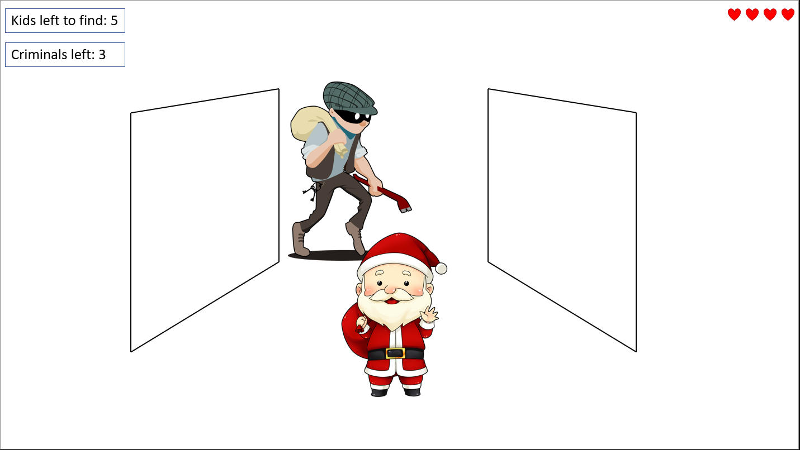

# Killer Christmas

**this christmas the naughty gets more than just coal**

## מהות המשחק
כשהמתנה היחידה שסנטה יכול לתת לילדים בחג המולד זה להציל אותם מפושעים.
סנטה משתמש בכל מה שיש לו בשביל לראות את החיוך של הילדים שנחטפו.
סנטה צריך לנווט בשקט ברחבי הבניין למצוא את הילדים ולהרוג את הפושעים.

מתאים לכל הפלטפורמות

---

## רכיבים רשמיים

### 1. שחקנים

* קהל היעד: 12+ מתאים כל הרמות, תחומי עניין: משחקי התחמקות
* המשחק מיועד לשחקן יחיד

### 2. יעדים

1. להציל את הילדים החטופים
2. להרוג את כל הפושעים
* כל היעדים יהיו כתובים לו בצד המסך 

### 3. תהליכים

* תחילת המשחק: השחקן יכנס ישר ללומדה בה הוא יהיה בדירה קטנה עם הסבר מהיר על מה עליו לעשות ואיך
* המשחק בנוי משלבים בהם כל שלב יותר מסובך מהקודם
בין אם יש יותר אויבים, הבניין גדול יותר ומסובך יותר או שיש יותר ילדים למצוא
*	סיום כל השלבים 
הלחצנים:
wasd : תנועה
lmb: התקפה
shift: ריצה
c: התכופפות

### 4. חוקים

* השחקן יכול לבצע רק 4 פעולות: לזוז, לרוץ (חלק מלזוז), להתכופף, להתקיף
* כאשר השחקן זז הוא עלול להתנגש בדברים וכך לגרום לרעש שמרתיע את הפושעים.
בנוסף על מנת להרוג פושע סנטה חייב להיות מאוד קרוב אילו אחרת ההתקפות לא יפגעו בו
* בעזרת לומדה פשוטה שמלמדת אותו צעד צעד את כל מה שהוא יכול לעשות

### 5. משאבים

* חיים  
סנטה חייב חיים על מנת שיוכל להמשיך להתקדם במשחק

סנטה מתחיל תמיד עם אותה כמות חיים

הדרך היחידה להשיג חיים היא על ידי מציאת חלב ועוגיות 
שמפוזרות בבניין ויש מספר מוגבל שלהם

יהיה נתן לראות את כמות החיים הנוכחית בצד המסך

### 6. עימותים

1. הפושעים שמסתובבים ברחבי הבניין 
2. צורת הבניין המסובכת שמקשה על התמצאות בתוכה

### 7. גבולות

העולם יהיה:
* סגור
* שטוח

ניתן לבחור שלבים ובכל שלב לא ניתן לצאת מכותלי הבניין 

* משמעות: על מנת להפוך את המשחק למסובך הוספת חדרים ומקומות מקשה על השחקן להתמצא וכך הופכת את המשחק למאתגר יותר
* ניידות: קשה להגיע מנקודה לנקודה במפה מטרת המשחק היא לנווט בין פושעים שמסתובבים 
* התמצאות: קשה להתמצא במפה שכן זה חלק מהקושי של המשחק
* עניין: בגלל שבכל רגע עלול לקפוץ עליך פושע או שאתה עלול למצוא דברים במשחק תמיד יש עניין ומתח במשחק.
* הכוונה: אין שכן מטרת המשחק היא למצוא דברים במשחק

### 8. תוצאות

1. הצלחת השלב
2. מוות
* התוצאות בעיקר תלויות בפעולות השחקן עם טיפה מזל של לאן הפושעים ילכו במפה

---

## סקר שוק

[Carrion] (https://store.steampowered.com/app/953490/CARRION/)

 Carrion  הוא משחק בו אתה משחק בתור מפלצת המנסה לברוח ממתחם 
היא עושה זאת על ידי ניווט במתחם בין חוקרים ושומרים.
המשחק שלנו שונה בכמה מובנים:
מכניקת המשחק שלנו פשוטה יותר וקל יותר
אצלנו יש יותר חשיבות להתחמקות שכן סנטה הוא לא מפלצת ענקית שיכולה לסבול הרבה פגיעות

[deadbydaylight](https://deadbydaylight.com/)

dead by daylight הוא משחק מורבה שחקנים בו יש לשחקים 2 תפקידים
1. להיות הרוצח שמסתובב ברחבי המפה
2. להיות ניצול המנסה לברוח מאותו רוצח
המשחק שלנו שונה בכך שהשחקן צריך לקיים את שתי התפקידים במקביל 
שכן הוא גם נחשב "לרוצח" וגם נחשב לניצול כי הוא הכי קל להריגה.

[Lucius](https://store.steampowered.com/app/218640/Lucius/)

Lucius זה משחק העוקב אחרי ילד שהשתלט עליו השטן
מטרת המשחק היא לסתובב באחוזה ענקית ולרצוח את תושבי האחוזה 
המשחק שלנו שונה בכך שסנטה נתפס תמיד כאויב ואינו יכול להסתובב באחוזה כאחד התושבים שלה
ולכן השחקן חייב תמיד להיות ערני לסכנות

הפעולות הפשוטות עם האיחוד של רמת קושי עולה המגיעה מהסביבה נותנת למשחק יחודיות משלו 

  "Easy to learn Hard to master"

